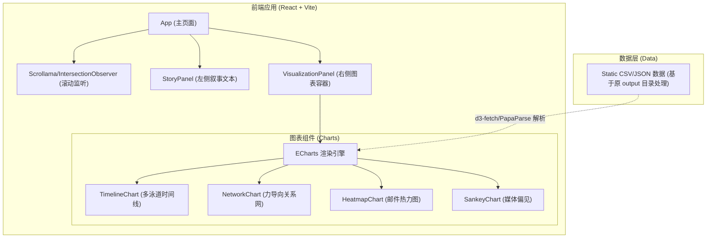

## 1. 架构设计



## 2. 技术描述
- **核心框架**: React@18 + Vite (极速构建)
- **样式方案**: Tailwind CSS v3 (实用类优先，便于快速构建暗黑主题和响应式布局)
- **可视化引擎**: Apache ECharts (`echarts` 及 `echarts-for-react`) - 负责渲染所有复杂的关系网、桑基图和时间轴。
- **滚动叙事交互**: `react-scrollama` 或原生的 `IntersectionObserver` API - 用于精确捕获左侧文本卡片到达屏幕视口中央的事件，从而触发右侧图表更新。
- **数据加载**: `papaparse` 或 `d3-fetch` - 考虑到原生数据为 CSV 格式，前端在挂载时会异步请求 public 目录下的 CSV 文件并解析为 JSON 供 ECharts 消费（如果为了前端极速体验，也可在构建前将 CSV 预处理为 JSON 静态引入）。

## 3. 目录结构设计 (规划)
```text
v2_visualization_web/
├── public/
│   └── data/               # 存放从原项目 output 复制过来的 CSV 数据文件
├── src/
│   ├── assets/             # 静态资源 (图片、字体)
│   ├── components/
│   │   ├── Scrollytelling/ # 滚动监听相关组件
│   │   └── Charts/         # ECharts 封装组件 (Timeline, Network 等)
│   ├── data/               # 数据解析与转换逻辑
│   ├── hooks/              # 自定义 Hooks (如 useScrollStep)
│   ├── App.jsx             # 根组件
│   └── index.css           # 全局样式与 Tailwind 注入
└── package.json
```

## 4. 数据流转定义
1. **初始化**：App 组件挂载，通过 `useEffect` 并发拉取并解析所有必要的 CSV 数据，存入全局状态或 React Context。
2. **状态驱动**：定义状态 `currentStep`（默认为 0）。
3. **滚动触发**：当用户滚动页面，某一个 Slide 的文本卡片进入视区触发线时，更新 `currentStep`。
4. **图表更新**：右侧的 `VisualizationPanel` 监听到 `currentStep` 改变，根据 Step 的索引渲染对应的图表组件（如 `step === 3` 时挂载 `TimelineChart` 组件），并传入预加载好的对应数据。
